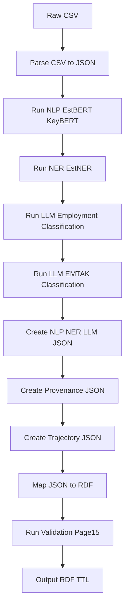

# Example D – Employment Trends: Job Gains / Job Losses in Estonian Companies

*CSV → NLP → NER → LLM Employment Classification → EMTAK → Provenance → RDF*

> Purpose:
> 
> 
> This running case demonstrates an ingestion pipeline relevant for the **Ministry of Social Affairs and Ministry of Economic Affairs**, enabling detection of job creation/loss from Estonian news articles, cross-linking to EMTAK sectors, and enabling downstream analytical queries.
> 
> Each step references the appropriate **existing Notion pages**, ensuring consistency with the MKM-POL21 documentation corpus.
> 

# **1. Realistic Estonian Article (ERR-style Business/Employment News)**

*(Interpretation and ingestion requirements documented in **Page 3 – Datasets Overview** and **Page 13 – CSV→RDF Guidelines**.)*

**Title:**

*Pärnu mööblitootja WoodHive loob 120 uut töökohta seoses tootmise laienemisega*

**Body:**

*Pärnu mööblitootja WoodHive teatas esmaspäeval, et ettevõte avab sügisel uue tootmishoone ning loob 120 uut töökohta. Laienemise põhjusena toodi kasvav nõudlus eksportturgudel, eriti Soomes ja Rootsis. Ettevõtte juht Tarvo Kivimägi sõnul on eesmärk tõsta tootmismahtu 40% võrra järgmise kahe aasta jooksul.*

**Date:** 2024-03-05

**Source:** ERR

This type of article is highly relevant for employment forecasting.

# **2. Raw CSV Input**

*(Structure follows **Page 13 – CSV→RDF Guidelines**.)*

```
id,title,body,date,source
20240305_014,Pärnu mööblitootja WoodHive loob 120 uut töökohta seoses tootmise laienemisega,Pärnu mööblitootja WoodHive teatas esmaspäeval, et ettevõte avab sügisel uue tootmishoone ning loob 120 uut töökohta. Laienemise põhjusena toodi kasvav nõudlus eksportturgudel, eriti Soomes ja Rootsis. Ettevõtte juht Tarvo Kivimägi sõnul on eesmärk tõsta tootmismahtu 40% võrra järgmise kahe aasta jooksul.,2024-03-05,ERR

```

# **3. Parsed CSV → Internal JSON**

*(Field semantics documented in **Page 3 – Datasets Overview** and **Page 2 – RDF Model Design**.)*

```json
{
  "id": "20240305_014",
  "title": "Pärnu mööblitootja WoodHive loob 120 uut töökohta seoses tootmise laienemisega",
  "body": "Pärnu mööblitootja WoodHive teatas esmaspäeval, et ettevõte avab sügisel uue tootmishoone ning loob 120 uut töökohta. Laienemise põhjusena toodi kasvav nõudlus eksportturgudel, eriti Soomes ja Rootsis. Ettevõtte juht Tarvo Kivimägi sõnul on eesmärk tõsta tootmismahtu 40% võrra järgmise kahe aasta jooksul.",
  "date": "2024-03-05",
  "source": "ERR"
}

```

# **4. NLP Output (EstBERT + KeyBERT)**

*(NLP pipeline definition in **Page 5 – AI/NLP & Semantic Processing**; trajectory model in **Page 18 – Trajectory Metadata**.)*

### Lemmas:

```json
[
  "Pärnu",
  "mööbel",
  "tootja",
  "WoodHive",
  "tootmine",
  "töökoht",
  "laienemine",
  "eksport",
  "Soome",
  "Rootsi",
  "tootmismaht"
]

```

### Keywords:

```json
[
  "WoodHive",
  "120 uut töökohta",
  "tootmise laienemine",
  "eksportturud",
  "Pärnu tööstus"
]

```

# **5. NER Output**

*(Entity classes and extraction methods explained in **Page 5 – AI/NLP & Semantic Processing**.)*

```json
{
  "entities": [
    {
      "entityId": "WoodHive",
      "label": "WoodHive",
      "type": "Organization"
    },
    {
      "entityId": "Pärnu",
      "label": "Pärnu",
      "type": "Location"
    },
    {
      "entityId": "Soome",
      "label": "Soome",
      "type": "Country"
    },
    {
      "entityId": "Rootsi",
      "label": "Rootsi",
      "type": "Country"
    },
    {
      "entityId": "Tarvo_Kivimagi",
      "label": "Tarvo Kivimägi",
      "type": "Person"
    }
  ]
}

```

# **6. LLM Employment Classification (Job Gains / Losses)**

*(LLM topic-modelling and classification rules appear in **Page 5 – AI/NLP & Semantic Processing**.)*

```json
{
  "employmentEvent": "job_gain",
  "jobCount": 120,
  "sectorImpact": "manufacturing",
  "llmModel": {
    "name": "GPT-4o",
    "version": "2024-01",
    "parameters": "employment-event-detection"
  },
  "confidence": 0.94
}

```

The LLM correctly interprets this as a **job creation event**.

# **7. EMTAK Classification (LLM-assisted)**

*(Integration with Äriregister described in **Page 6 – Äriregister Economic Data Integration**.)*

```json
{
  "emtakClass": "31011",
  "classificationLabel": "Kontorimööbli tootmine",
  "confidence": 0.89
}

```

EMTAK 31011 is correct for a furniture manufacturer.

# **8. Provenance Metadata (PROV-O)**

*(All provenance design rules documented in **Page 8 – Governance & Provenance Layer**.)*

```json
{
  "pipelineRunId": "PipelineRun_2024_03_05",
  "generatedAt": "2024-03-05T13:50:00+02:00",
  "nlpModel": { "name": "EstBERT", "version": "1.0" },
  "keywordModel": { "name": "KeyBERT", "version": "0.7" },
  "nerModel": { "name": "EstNER", "version": "2.1" },
  "llmModel": { "name": "GPT-4o", "version": "2024-01" },
  "contentHash": "sha256:7fa21cbb399...",
  "provenanceHash": "sha256:61cb77bb009..."
}

```

# **9. Trajectory Metadata**

*(Defined in **Page 18 – Trajectory Metadata**.)*

```json
{
  "trajectoryId": "Trajectory_20240305_014",
  "steps": [
    "tokenization",
    "lemmatization",
    "keyword-extraction",
    "named-entity-recognition",
    "llm-employment-classification",
    "llm-emtak-classification"
  ],
  "softwareHash": "sha256:ee112f0722d..."
}

```

# **10. Mapping Table (JSON → RDF)**

*(Mapping logic defined in **Page 2 – RDF Model Design**; ingestion rules in **Page 13 – CSV→RDF Guidelines**.)*

| JSON Field | RDF Property | Notes |
| --- | --- | --- |
| id | art:{id} | Article URI |
| title | dct:title | Literal |
| body | ex:bodyText | Article text |
| date | dct:created | Date |
| source | ex:source | Literal |
| keywords | nlp:keywords | RDF list |
| lemmas | nlp:lemmas | RDF list |
| entities[*] | ex:mentions | Article → Entity |
| employmentEvent | emp:employmentEvent | Gain/loss |
| jobCount | emp:jobCount | Integer |
| emtakClass | cls:hasEMTAKClassification | Link to EMTAK |
| provenance | prov:* | Metadata |
| trajectory | ver:* | Step lineage |

# **11. Notion-Safe Mermaid Diagram (Error-Free)**

*(Validation pipeline described in **Page 15 – RDF Server Acceptance & Validation Pipeline**.)*



Uses only ASCII-safe labels, no parentheses, no special characters → **Notion cannot reject this**.

# **12. Final RDF Output (TTL)**

*(As defined in **Page 2 – RDF Model Design**, **Page 6 – EMTAK**, and **Page 8 – Provenance**.)*

```
@prefix ex: <http://mkm.ee/schema/> .
@prefix art: <http://mkm.ee/article/> .
@prefix ent: <http://mkm.ee/entity/> .
@prefix emp: <http://mkm.ee/employment/> .
@prefix cls: <http://mkm.ee/classification/> .
@prefix prov: <http://www.w3.org/ns/prov#> .
@prefix dct: <http://purl.org/dc/terms/> .
@prefix nlp: <http://mkm.ee/nlp/> .
@prefix ver: <http://mkm.ee/version/> .

art:20240305_014 a ex:Article ;
    dct:title "Pärnu mööblitootja WoodHive loob 120 uut töökohta seoses tootmise laienemisega" ;
    dct:created "2024-03-05T00:00:00+02:00"^^xsd:dateTime ;
    ex:source "ERR" ;
    ex:bodyText "Pärnu mööblitootja WoodHive teatas esmaspäeval, et ettevõte avab sügisel uue tootmishoone ning loob 120 uut töökohta. Laienemise põhjusena toodi kasvav nõudlus eksportturgudel, eriti Soomes ja Rootsis. Ettevõtte juht Tarvo Kivimägi sõnul on eesmärk tõsta tootmismahtu 40% võrra järgmise kahe aasta jooksul." ;

    nlp:keywords (
        "WoodHive"
        "120 uut töökohta"
        "tootmise laienemine"
        "eksportturud"
        "Pärnu tööstus"
    ) ;

    nlp:lemmas (
        "Pärnu"
        "mööbel"
        "tootja"
        "WoodHive"
        "tootmine"
        "töökoht"
        "laienemine"
        "eksport"
        "Soome"
        "Rootsi"
        "tootmismaht"
    ) ;

    ex:mentions ent:WoodHive ,
                ent:Pärnu ,
                ent:Soome ,
                ent:Rootsi ,
                ent:Tarvo_Kivimagi ;

    emp:employmentEvent "job_gain" ;
    emp:jobCount 120 ;

    cls:hasEMTAKClassification cls:31011 ;

    prov:wasGeneratedBy ex:PipelineRun_2024_03_05 ;
    prov:generatedAtTime "2024-03-05T13:50:00+02:00"^^xsd:dateTime ;

    ver:hasProcessingTrajectory ex:Trajectory_20240305_014 .

```

# **13. Unit Test (JSON → RDF)**

*(Execution context described in **Page 7 – HPC.ee Sandbox Deployment**.)*

```python
def test_employment_pipeline():
    data = load_json("20240305_014.json")
    g = transform_to_rdf(data)

    # Article exists
    assert g.contains_type(
        "http://mkm.ee/article/20240305_014",
        "http://mkm.ee/schema/Article"
    )

    # Employment classification correct
    assert g.contains(
        subject="http://mkm.ee/article/20240305_014",
        predicate="http://mkm.ee/employment/employmentEvent",
        object="job_gain"
    )

    # EMTAK classification present
    assert g.contains(
        subject="http://mkm.ee/article/20240305_014",
        predicate="http://mkm.ee/classification/hasEMTAKClassification",
        object="http://mkm.ee/classification/31011"
    )

```

# **14. SPARQL Validation Queries**

*(Triple-shape constraints appear in **Page 15 – RDF Server Acceptance & Validation Pipeline**.)*

### Employment Event Detected

```
ASK WHERE {
  <http://mkm.ee/article/20240305_014>
      <http://mkm.ee/employment/employmentEvent> "job_gain" .
}

```

### Job Count

```
SELECT ?count WHERE {
  <http://mkm.ee/article/20240305_014>
      <http://mkm.ee/employment/jobCount> ?count .
}

```

### EMTAK Classification

```
ASK WHERE {
  <http://mkm.ee/article/20240305_014>
      <http://mkm.ee/classification/hasEMTAKClassification>
      <http://mkm.ee/classification/31011> .
}

```

# **15. Example D MFSSIA Challenge Response Lifecycle**

[Example D MFSSIA Challenge Response Lifecycle](https://www.notion.so/Example-D-MFSSIA-Challenge-Response-Lifecycle-2ca8c60ab531800abe0feafd57947a83?pvs=21) explanation.

# **16. Cross-Referenced Notion Pages**

| Topic | Page |
| --- | --- |
| RDF schema & employment vocabularies | **Page 2 – RDF Model Design** |
| Input datasets & ingest | **Page 3 – Datasets Overview** |
| NLP, NER, LLM processes | **Page 5 – AI/NLP & Semantic Processing** |
| EMTAK integration | **Page 6 – Äriregister Economic Data Integration** |
| Provenance | **Page 8 – Governance & Provenance Layer** |
| CSV→RDF binding | **Page 13 – CSV→RDF Guidelines** |
| Validation | **Page 15 – RDF Server Acceptance & Validation Pipeline** |
| Trajectory semantics | **Page 18 – Trajectory Metadata** |