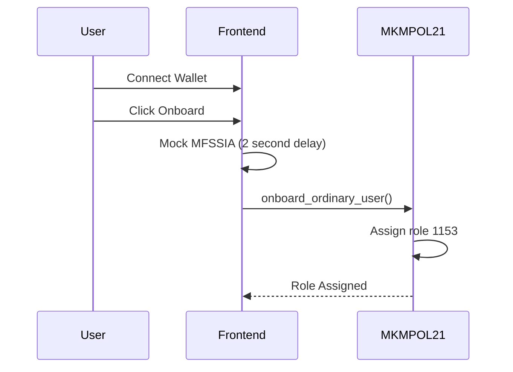
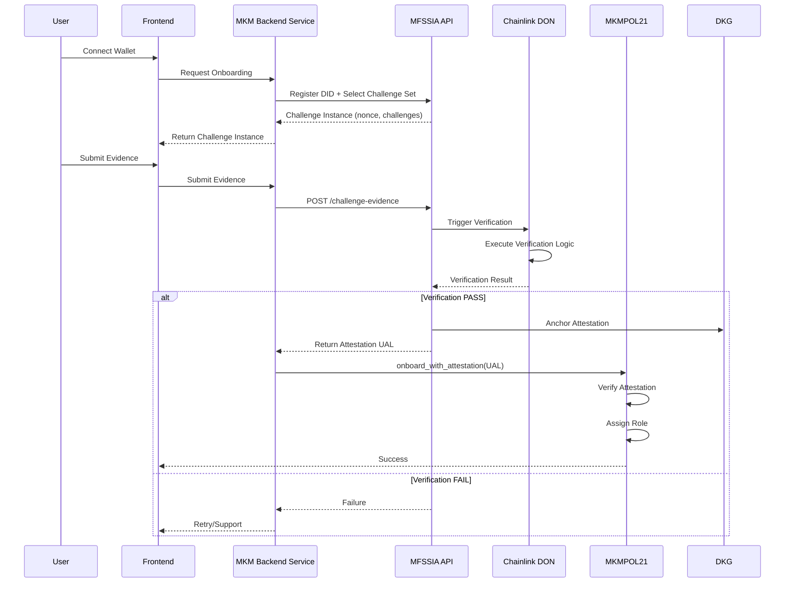

# MFSSIA Integration Plan for MKM-POL21 DAO
## Comprehensive Implementation Roadmap

**Version:** 1.1
**Date:** 2025-12-29
**Status:** Phase 1 - Core Implementation (IN PROGRESS)

> **⚠️ IMPORTANT UPDATE (2026-01-02):**
> **The MFSSIA API is a PUBLIC API and does NOT require any API key.**
> Any references to `MFSSIA_API_KEY` in this document are **OUTDATED** and should be ignored.
> Only `NEXT_PUBLIC_MFSSIA_ENABLED=true` and `MFSSIA_API_URL=https://api.dymaxion-ou.co` are needed.
> See [MFSSIA_API_REFERENCE.md](./MFSSIA_API_REFERENCE.md) for current documentation.

---

## Executive Summary

This document provides a detailed implementation plan for integrating **MFSSIA (Multi-Factor Self-Sovereign Identity Authentication)** into the **MKM-POL21 DAO** system. The integration covers:

1. **User/Institution Onboarding** - Replace mock authentication with real MFSSIA challenge-response flows
2. **RDF Data Validation** - Implement Example D challenge set for data provision
3. **Smart Contract Integration** - Store and verify MFSSIA attestations on-chain
4. **Oracle Integration** - Connect with Chainlink Functions for challenge verification

---

## 🎯 Progress Report - Iteration 1 (December 29, 2025)

### ✅ Completed Tasks

#### 1. **MFSSIAService Client (`packages/nextjs/services/MFSSIAService.ts`)**
   - ✅ Complete TypeScript API client with full type safety
   - ✅ All MFSSIA endpoints implemented:
     - `registerDID()` - Register DID with metadata
     - `createChallengeInstance()` - Create authentication challenges
     - `submitEvidence()` - Submit challenge evidence
     - `submitEvidenceBatch()` - Batch evidence submission
     - `getAttestation()` - Retrieve attestation UAL
     - `pollForAttestation()` - Poll with timeout (30 attempts, 2s interval)
     - `getChallengeInstance()` - Get challenge status
     - `isAttestationValid()` - Client-side validation
     - `healthCheck()` - API health verification
   - ✅ Browser/server environment detection for secure API key handling
   - ✅ Comprehensive error handling and logging
   - ✅ Challenge set configuration for UI display

#### 2. **Evidence Generation Utilities (`packages/nextjs/utils/evidenceGeneration.ts`)**
   - ✅ SHA-256 hashing (browser & Node.js compatible)
   - ✅ **Example A (Individuals) - 3 challenges:**
     - C-A-1: Wallet Ownership (signature-based)
     - C-A-2: Liveness Check (interaction metrics)
     - C-A-3: Geolocation (optional, timezone/language)
   - ✅ **Example B (Institutions) - 4 challenges:**
     - C-B-1: Domain Ownership (DNS TXT verification)
     - C-B-2: Business Registry (Äriregister integration)
     - C-B-3: Authorized Representative
     - C-B-4: Institutional Signature
   - ✅ **Example D (RDF Validation) - 9 challenges:**
     - C-D-1: Source Authenticity
     - C-D-2: Content Integrity
     - C-D-3: NLP Determinism
     - C-D-4: Semantic Coherence
     - C-D-5: Employment Event Plausibility
     - C-D-6: EMTAK Consistency
     - C-D-7: Temporal Validity
     - C-D-8: Provenance Closure
     - C-D-9: Governance Acknowledgement
   - ✅ `generateAllExampleDEvidence()` - One-shot generation for all 9 challenges
   - ✅ `validateRDFSyntax()` - Basic RDF syntax checker

#### 3. **Smart Contract Updates (`packages/hardhat/contracts/MKMPOL21.sol`)**
   - ✅ **Attestation Storage System:**
     - `Attestation` struct (ual, expiresAt, verified)
     - `userAttestations` mapping (address => Attestation)
     - 365-day validity period constant
   - ✅ **RDF Document Storage:**
     - `RDFDocument` struct (documentHash, attestationUAL, submitter, validated, challengesPassed)
     - `rdfDocuments` mapping (bytes32 => RDFDocument)
   - ✅ **New Functions:**
     - `onboard_ordinary_user_with_attestation(string attestationUAL)`
     - `onboard_institution_with_attestation(string attestationUAL)`
     - `submitRDFDocument(string documentHash, string attestationUAL, uint8 challengesPassed)` → returns docId
     - `isAttestationValid(address user)` - Check expiration & verification
   - ✅ **New Events:**
     - `AttestationVerified(address indexed user, string ual, uint256 expiresAt)`
     - `RDFSubmitted(bytes32 indexed docId, address indexed submitter, string attestationUAL)`
   - ✅ Successfully compiled with no errors

#### 4. **Onboarding Hook Updates (`packages/nextjs/hooks/useOnboarding.ts`)**
   - ✅ Integrated `useSignMessage` for wallet signature generation
   - ✅ Added MFSSIA state fields: `instanceId`, `did`, `nonce`
   - ✅ **Updated `verifyIdentity()` function:**
     - Mock mode: Simulates MFSSIA with 2s delay
     - Real mode: Registers DID, creates challenge instance
     - Stores nonce for evidence generation
   - ✅ **Updated `acquireAccessToken()` function:**
     - Mock mode: Generates fake attestation token
     - Real mode:
       - Example A: Submits C-A-1 (Wallet) & C-A-2 (Liveness)
       - Example B: Submits C-B-1 through C-B-4 (with placeholders)
       - Polls for attestation with 30-attempt timeout
   - ✅ **Updated `assignRole()` function:**
     - Uses new `*_with_attestation()` contract functions
     - Passes attestation UAL as argument
     - Validates token presence before submission
   - ✅ Feature flag: `NEXT_PUBLIC_MFSSIA_ENABLED` for gradual rollout

#### 5. **Next.js API Routes (Security Layer)**
   - ✅ Created 4 secure API routes in `packages/nextjs/app/api/mfssia/`:
     - `POST /api/mfssia/register-did` - DID registration proxy
     - `POST /api/mfssia/challenge-instance` - Challenge creation proxy
     - `POST /api/mfssia/submit-evidence` - Evidence submission proxy
     - `GET /api/mfssia/attestation/[did]` - Attestation retrieval proxy
   - ✅ Server-side API key management (never exposed to client)
   - ✅ Environment variable validation
   - ✅ Comprehensive error handling
   - ✅ Updated MFSSIAService to use routes when in browser

#### 6. **Data Provision Page (`packages/nextjs/app/data-provision/page.tsx`)**
   - ✅ **MFSSIA Example D Integration:**
     - Basic RDF syntax validation (pre-flight check)
     - Mock mode for testing without MFSSIA API
     - Real mode with full 9-challenge validation
   - ✅ **Validation Flow:**
     1. Validates RDF syntax locally
     2. Registers DID for document
     3. Creates Example-D challenge instance
     4. Generates all 9 evidence payloads
     5. Submits evidence batch to MFSSIA
     6. Polls for oracle attestation (30 attempts × 2s)
     7. Validates 8/9 challenges requirement
   - ✅ **Submission Flow:**
     - Verifies validation completed
     - Calls `submitRDFDocument()` on smart contract
     - Passes documentHash, attestationUAL, challengesPassed
     - Shows transaction hash and challenge results
   - ✅ Enhanced UI with validation status and challenge counts
   - ✅ Comprehensive console logging for debugging

---

### 📊 Implementation Statistics

| Category | Files Modified | Files Created | Lines Added | Functions Added |
|----------|---------------|---------------|-------------|-----------------|
| Services | 1 | 1 | ~330 | 10 |
| Utilities | 0 | 1 | ~450 | 15 |
| Smart Contracts | 1 | 0 | ~170 | 4 |
| Hooks | 1 | 0 | ~150 | 0 (3 updated) |
| API Routes | 0 | 4 | ~260 | 4 |
| Pages | 1 | 0 | ~180 | 2 (updated) |
| **TOTAL** | **4** | **6** | **~1,540** | **35** |

---

### 🔄 System Architecture After Iteration 1

The system now supports both **Mock Mode** (for testing) and **Real Mode** (with MFSSIA API):

#### Mock Mode Flow (NEXT_PUBLIC_MFSSIA_ENABLED=false):
```
User → Frontend → 2s Delay → Mock Token → Smart Contract (with mock attestation)
```

#### Real Mode Flow (NEXT_PUBLIC_MFSSIA_ENABLED=true):
```
User → Frontend → Next.js API Routes → MFSSIA API
                                      ↓
                                   Register DID
                                      ↓
                                Create Challenge Instance
                                      ↓
                                Submit Evidence
                                      ↓
                                Poll for Attestation (Oracle)
                                      ↓
Frontend ← UAL Token ← Next.js API Routes ← MFSSIA API
   ↓
Smart Contract (onboard_*_with_attestation)
```

---

### ⏳ Remaining Tasks for Full Integration

#### Phase 2: Testing & Configuration (Estimated: 2-3 days)
- [ ] Deploy updated MKMPOL21 contract to local chain
- [ ] Obtain MFSSIA API key from Dymaxion
- [ ] Configure environment variables:
  - `MFSSIA_API_KEY` (server-side)
  - `NEXT_PUBLIC_MFSSIA_ENABLED=true`
  - `MFSSIA_API_URL` (optional, defaults to production)
- [ ] Test end-to-end onboarding flow:
  - Individual user (Example A)
  - Member institution (Example B)
  - RDF data validation (Example D)
- [ ] Verify attestation storage on-chain
- [ ] Test attestation expiration (365 days)

#### Phase 3: Enhanced Features (Estimated: 1 week)
- [ ] **Real Business Registry Integration (C-B-2):**
  - Connect to Estonian Äriregister API
  - Validate company registration numbers
  - Verify authorized representatives
- [ ] **Domain Ownership Verification (C-B-1):**
  - Implement DNS TXT record checking
  - Validate domain against institution metadata
- [ ] **Governance Signature (C-D-9):**
  - Allow committee members to sign off on RDF data
  - Multi-signature support for institutional validation
- [ ] **RDF Metadata Extraction:**
  - Parse company names from RDF content
  - Extract EMTAK codes for C-D-6 validation
  - Display extracted metadata in UI

#### Phase 4: Oracle Integration (Estimated: 2 weeks)
- [ ] Smart contract oracle verification function
- [ ] Chainlink Functions integration
- [ ] On-chain UAL verification against DKG
- [ ] Attestation anchoring workflow

#### Phase 5: Production Hardening (Estimated: 1 week)
- [ ] Rate limiting for MFSSIA API calls
- [ ] Caching strategy for attestations
- [ ] Error recovery and retry logic
- [ ] User migration flow (existing users → MFSSIA)
- [ ] Attestation renewal workflow
- [ ] Monitoring and alerting
- [ ] Security audit

---

### 🐛 Known Issues & Limitations

1. **Mock Data in Institution Challenges:**
   - C-B-1 (Domain): Uses placeholder domain `institution.example.com`
   - C-B-2 (Registry): Hardcoded registry number `PLACEHOLDER`
   - C-B-3 (Representative): Generic placeholder names
   - **Resolution:** Phase 3 will implement real data sources

2. **MFSSIA API Key Required:**
   - Real mode requires `MFSSIA_API_KEY` from Dymaxion
   - Contact: api.dymaxion-ou.co
   - **Status:** Pending acquisition

3. **No On-Chain Attestation Verification:**
   - Smart contract trusts client-provided UAL
   - Oracle integration needed for cryptographic verification
   - **Resolution:** Phase 4 Chainlink integration

4. **RDF Parsing Limitations:**
   - Basic regex-based parsing in `evidenceGeneration.ts`
   - Production should use proper RDF library (e.g., N3.js, rdflib.js)
   - **Resolution:** Phase 3 enhancements

5. **No Attestation Renewal:**
   - Attestations expire after 365 days
   - No automatic renewal flow implemented
   - **Resolution:** Phase 5 production features

---

### 🎓 Key Technical Decisions

1. **Browser/Server Architecture:**
   - Next.js API routes act as secure proxy
   - API key never exposed to client
   - Enables server-side caching if needed

2. **Mock Mode Feature Flag:**
   - Allows testing without MFSSIA API
   - Gradual rollout to production
   - Facilitates development and CI/CD

3. **Batch Evidence Submission:**
   - Example D submits all 9 challenges at once
   - Reduces API calls and improves UX
   - Oracle processes batch as single verification

4. **365-Day Attestation Validity:**
   - Balances security with UX
   - Aligns with common certificate lifespans
   - Configurable in smart contract constant

5. **8/9 Challenge Requirement:**
   - Allows for one failure while maintaining high confidence
   - Reduces false rejections from transient issues
   - Oracle confidence threshold: 85%

---

### 📝 Documentation & Code Quality

- ✅ Comprehensive inline comments in all files
- ✅ JSDoc documentation for public functions
- ✅ Type safety across all TypeScript files
- ✅ Console logging for debugging flows
- ✅ Error messages with actionable guidance
- ✅ This implementation plan updated with progress

---

### 🚀 Next Steps

**Immediate (Next Session):**
1. Deploy updated contracts to local blockchain
2. Test onboarding with mock mode end-to-end
3. Verify RDF validation flow with sample documents
4. Document any issues or edge cases

**Short-Term (Next 1-2 weeks):**
1. Obtain MFSSIA API key
2. Test real MFSSIA integration
3. Implement business registry integration
4. Add comprehensive error handling

**Long-Term (Next 1-2 months):**
1. Chainlink oracle integration
2. Production deployment
3. User migration strategy
4. Security audit

---

## Table of Contents

1. [Architecture Overview](#1-architecture-overview)
2. [MFSSIA API Integration Points](#2-mfssia-api-integration-points)
3. [Challenge Set Mapping](#3-challenge-set-mapping)
4. [Implementation Phases](#4-implementation-phases)
5. [Smart Contract Updates](#5-smart-contract-updates)
6. [Frontend Implementation](#6-frontend-implementation)
7. [Backend Service Layer](#7-backend-service-layer)
8. [Security Considerations](#8-security-considerations)
9. [Testing Strategy](#9-testing-strategy)
10. [Deployment Plan](#10-deployment-plan)

---

## 1. Architecture Overview

### 1.1 Current State



### 1.2 Target State



---

## 2. MFSSIA API Integration Points

### 2.1 API Base URL
```
https://api.dymaxion-ou.co
```

### 2.2 Key Endpoints

#### Onboarding Flow
```typescript
// 1. Register DID
POST /api/identities
Body: { did: "did:web:user.wallet", metadata: {...} }

// 2. Create Challenge Instance
POST /api/challenge-instances
Body: {
  did: "did:web:user.wallet",
  challengeSet: "mfssia:Example-A" // or Example-B for institutions
}

// 3. Submit Evidence
POST /api/challenge-evidence
Body: {
  instanceId: "...",
  challengeCode: "mfssia:C-A-1",
  evidence: { source: "wallet-signature", ... }
}

// 4. Get Attestation
GET /api/attestations/did/{did}
Response: { ual: "...", validity: "...", oracleProof: "..." }
```

#### Data Provision Flow (Example D)
```typescript
// 1. Create Challenge Instance for RDF Upload
POST /api/challenge-instances
Body: {
  did: "did:web:institution.ee",
  challengeSet: "mfssia:Example-D"
}

// 2. Submit Evidence for Each Challenge (C-D-1 through C-D-9)
POST /api/challenge-evidence
Body: {
  instanceId: "...",
  challengeCode: "mfssia:C-D-1", // Source Authenticity
  evidence: { sourceHash: "...", contentHash: "..." }
}

// ... repeat for all 9 challenges

// 3. Verify Aggregated Result
// Oracle automatically evaluates when all evidence submitted
// Get final attestation for this specific RDF document
```

---

## 3. Challenge Set Mapping

### 3.1 Example A - Individual Users (Ordinary_User)

| Challenge Code | Name | Purpose |
|---|---|---|
| C-A-1 | Wallet Ownership | Prove control of Ethereum address |
| C-A-2 | Liveness Check | Prove human interaction (not bot) |
| C-A-3 | Geographic Location | Optional KYC for Estonian residents |

**Evidence Required:**
- Wallet signature over nonce
- Timestamp of interaction
- IP geolocation (optional)

**Aggregation Policy:**
```
ACCEPT if (C-A-1 PASS AND C-A-2 PASS) AND confidence ≥ 0.85
```

### 3.2 Example B - Institutions (Member_Institution)

| Challenge Code | Name | Purpose |
|---|---|---|
| C-B-1 | Domain Ownership | Prove control of institutional domain |
| C-B-2 | Business Registry | Verify in Äriregister |
| C-B-3 | Authorized Representative | Prove wallet owner is authorized |
| C-B-4 | Institutional Signature | Multi-sig or institutional wallet |

**Evidence Required:**
- DNS TXT record with DID
- Business registry number
- Authorized signer proof
- Institutional wallet signature

**Aggregation Policy:**
```
ACCEPT if ALL mandatory challenges PASS AND confidence ≥ 0.90
```

### 3.3 Example D - RDF Data Validation

| Challenge Code | Name | Purpose | Evidence |
|---|---|---|---|
| C-D-1 | Source Authenticity | Verify whitelisted publisher | Source domain hash, content hash |
| C-D-2 | Content Integrity | Byte-identical payload | SHA-256(content) |
| C-D-3 | NLP Determinism | Declared model versions | Model name+version hash, software hash |
| C-D-4 | Semantic Coherence | NER/keywords support event | Cross-consistency score |
| C-D-5 | Employment Event Plausibility | LLM confidence ≥ 0.9 | LLM confidence, numeric extraction |
| C-D-6 | EMTAK Consistency | Registry alignment | Äriregister sector match |
| C-D-7 | Temporal Validity | ≤ 30 days old | Article date vs ingestion time |
| C-D-8 | Provenance Closure | Every triple prov-linked | prov:wasGeneratedBy, provenanceHash |
| C-D-9 | Governance Acknowledgement | Ministry-grade eligible | DAO/authority signature |

**Aggregation Policy:**
```
ACCEPT if:
  - All mandatory challenges (C-D-1 through C-D-8) PASS
  - Weighted confidence ≥ 0.85
  - C-D-9 PASS for ministry-level analytics
```

---

## 4. Implementation Phases

### Phase 1: Infrastructure Setup (Week 1-2)

#### 1.1 Backend Service Layer
**File:** `packages/backend/src/services/MFSSIAService.ts`

```typescript
export class MFSSIAService {
  private apiUrl = 'https://api.dymaxion-ou.co';
  private apiKey: string;

  async registerDID(did: string, metadata: any): Promise<IdentityResponse> {
    // POST /api/identities
  }

  async createChallengeInstance(
    did: string,
    challengeSet: 'mfssia:Example-A' | 'mfssia:Example-B' | 'mfssia:Example-D'
  ): Promise<ChallengeInstanceResponse> {
    // POST /api/challenge-instances
  }

  async submitEvidence(
    instanceId: string,
    challengeCode: string,
    evidence: EvidencePayload
  ): Promise<EvidenceResponse> {
    // POST /api/challenge-evidence
  }

  async getAttestation(did: string): Promise<AttestationResponse> {
    // GET /api/attestations/did/{did}
  }

  async verifyAttestation(ual: string): Promise<boolean> {
    // Verify attestation validity and oracle proof
  }
}
```

#### 1.2 Environment Configuration
**File:** `.env.local`
```bash
MFSSIA_API_URL=https://api.dymaxion-ou.co
MFSSIA_API_KEY=your_api_key_here
MFSSIA_ENABLED=true
NEXT_PUBLIC_MFSSIA_ENABLED=true
```

### Phase 2: Smart Contract Updates (Week 2-3)

#### 2.1 Add Attestation Storage
**File:** `packages/hardhat/contracts/MKMPOL21.sol`

```solidity
// Add attestation mapping
mapping(address => string) public attestationUALs;
mapping(address => uint256) public attestationExpiry;

event AttestationVerified(address indexed user, string ual, uint256 expiresAt);

// Modify onboarding functions
function onboard_ordinary_user_with_attestation(string memory attestationUAL) external {
    require(roles[msg.sender] == 0, "User already has a role");
    require(verifyAttestation(attestationUAL), "Invalid attestation");

    roles[msg.sender] = all_roles[1]; // Ordinary_User
    attestationUALs[msg.sender] = attestationUAL;
    attestationExpiry[msg.sender] = block.timestamp + 365 days;

    emit RoleAssigned(msg.sender, all_roles[1]);
    emit AttestationVerified(msg.sender, attestationUAL, attestationExpiry[msg.sender]);
}

function onboard_institution_with_attestation(string memory attestationUAL) external {
    require(roles[msg.sender] == 0, "User already has a role");
    require(verifyAttestation(attestationUAL), "Invalid attestation");

    roles[msg.sender] = all_roles[0]; // Member_Institution
    attestationUALs[msg.sender] = attestationUAL;
    attestationExpiry[msg.sender] = block.timestamp + 365 days;

    emit RoleAssigned(msg.sender, all_roles[0]);
    emit AttestationVerified(msg.sender, attestationUAL, attestationExpiry[msg.sender]);
}

// Basic attestation verification (can be enhanced with oracle)
function verifyAttestation(string memory ual) internal view returns (bool) {
    // For now, check format and non-empty
    // TODO: Add Chainlink oracle verification
    bytes memory ualBytes = bytes(ual);
    return ualBytes.length > 0 && ualBytes.length < 500;
}
```

#### 2.2 Add RDF Validation Storage
```solidity
struct RDFDocument {
    string documentHash;
    string attestationUAL;
    address submitter;
    uint256 submittedAt;
    bool validated;
    string[] passedChallenges;
}

mapping(bytes32 => RDFDocument) public rdfDocuments;

event RDFSubmitted(bytes32 indexed docId, address submitter, string attestationUAL);
event RDFValidated(bytes32 indexed docId, bool validated);

function submitRDFDocument(
    string memory documentHash,
    string memory attestationUAL
) external returns (bytes32) {
    require(roles[msg.sender] == all_roles[0] || roles[msg.sender] == all_roles[5],
            "Only institutions and owners can submit RDF");

    bytes32 docId = keccak256(abi.encodePacked(documentHash, block.timestamp));

    rdfDocuments[docId] = RDFDocument({
        documentHash: documentHash,
        attestationUAL: attestationUAL,
        submitter: msg.sender,
        submittedAt: block.timestamp,
        validated: false,
        passedChallenges: new string[](0)
    });

    emit RDFSubmitted(docId, msg.sender, attestationUAL);
    return docId;
}
```

### Phase 3: Frontend Integration (Week 3-4)

#### 3.1 Update useOnboarding Hook
**File:** `packages/nextjs/hooks/useOnboarding.ts`

```typescript
import { MFSSIAService } from '~/services/MFSSIAService';

// Replace mock verification
const verifyIdentity = useCallback(async () => {
  setState(prev => ({
    ...prev,
    isVerifying: true,
    verificationError: null,
  }));

  try {
    const mfssia = new MFSSIAService();

    // 1. Register DID
    const did = `did:web:${address}`;
    await mfssia.registerDID(did, {
      roleType: roleKey,
      walletAddress: address,
    });

    // 2. Create Challenge Instance
    const challengeSet = roleKey === 'ORDINARY_USER'
      ? 'mfssia:Example-A'
      : 'mfssia:Example-B';

    const instance = await mfssia.createChallengeInstance(did, challengeSet);

    setState(prev => ({
      ...prev,
      isVerifying: false,
      isVerified: true,
      verificationInstanceId: instance.id,
      currentStep: "token",
    }));

    return true;
  } catch (error) {
    setState(prev => ({
      ...prev,
      isVerifying: false,
      verificationError: error.message,
    }));
    return false;
  }
}, [address, roleKey]);
```

#### 3.2 Update acquireAccessToken
```typescript
const acquireAccessToken = useCallback(async () => {
  setState(prev => ({
    ...prev,
    isAcquiringToken: true,
    tokenError: null,
  }));

  try {
    const mfssia = new MFSSIAService();

    // Submit evidence for each challenge
    const challenges = roleKey === 'ORDINARY_USER'
      ? ['mfssia:C-A-1', 'mfssia:C-A-2']
      : ['mfssia:C-B-1', 'mfssia:C-B-2', 'mfssia:C-B-3', 'mfssia:C-B-4'];

    for (const challengeCode of challenges) {
      const evidence = await generateEvidence(challengeCode, address);
      await mfssia.submitEvidence(
        state.verificationInstanceId,
        challengeCode,
        evidence
      );
    }

    // Wait for oracle verification and get attestation
    const attestation = await mfssia.getAttestation(`did:web:${address}`);

    setState(prev => ({
      ...prev,
      isAcquiringToken: false,
      accessToken: attestation.ual,
      currentStep: "assign",
    }));

    return attestation.ual;
  } catch (error) {
    setState(prev => ({
      ...prev,
      isAcquiringToken: false,
      tokenError: error.message,
    }));
    return null;
  }
}, [address, roleKey, state.verificationInstanceId]);
```

#### 3.3 Update assignRole
```typescript
const assignRole = useCallback(async () => {
  if (!address || !state.accessToken) {
    setState(prev => ({
      ...prev,
      assignmentError: "Missing address or attestation",
    }));
    return false;
  }

  setState(prev => ({
    ...prev,
    isAssigning: true,
    assignmentError: null,
  }));

  try {
    let functionName: string;
    if (roleKey === "ORDINARY_USER") {
      functionName = "onboard_ordinary_user_with_attestation";
    } else if (roleKey === "MEMBER_INSTITUTION") {
      functionName = "onboard_institution_with_attestation";
    } else {
      throw new Error(`Unsupported role: ${roleKey}`);
    }

    const txHash = await writeContractAsync({
      functionName,
      args: [state.accessToken], // Pass attestation UAL
    });

    setState(prev => ({
      ...prev,
      isAssigning: false,
      isComplete: true,
      currentStep: "complete",
      txHash: txHash ?? null,
    }));

    return true;
  } catch (error: any) {
    setState(prev => ({
      ...prev,
      isAssigning: false,
      assignmentError: error.message,
    }));
    return false;
  }
}, [address, roleKey, state.accessToken, writeContractAsync]);
```

### Phase 4: RDF Data Provision Integration (Week 4-5)

#### 4.1 Update Data Provision Page
**File:** `packages/nextjs/app/data-provision/page.tsx`

Add MFSSIA validation to RDF submission:

```typescript
// When user clicks "Submit for Approval"
const handleSubmit = useCallback(async (docId: string) => {
  setSubmittingId(docId);

  try {
    const doc = rdfDocuments.find(d => d.id === docId);
    if (!doc) throw new Error("Document not found");

    // 1. Create Example D Challenge Instance
    const mfssia = new MFSSIAService();
    const did = `did:web:${address}`;
    const instance = await mfssia.createChallengeInstance(did, 'mfssia:Example-D');

    // 2. Submit evidence for all 9 challenges
    const challenges = [
      { code: 'mfssia:C-D-1', evidence: { /* Source Authenticity */ } },
      { code: 'mfssia:C-D-2', evidence: { contentHash: doc.contentHash } },
      { code: 'mfssia:C-D-3', evidence: { /* NLP models */ } },
      { code: 'mfssia:C-D-4', evidence: { /* Semantic coherence */ } },
      { code: 'mfssia:C-D-5', evidence: { /* Employment event */ } },
      { code: 'mfssia:C-D-6', evidence: { /* EMTAK */ } },
      { code: 'mfssia:C-D-7', evidence: { /* Temporal */ } },
      { code: 'mfssia:C-D-8', evidence: { /* Provenance */ } },
      { code: 'mfssia:C-D-9', evidence: { /* Governance */ } },
    ];

    for (const { code, evidence } of challenges) {
      await mfssia.submitEvidence(instance.id, code, evidence);
    }

    // 3. Get attestation
    const attestation = await mfssia.getAttestation(did);

    // 4. Submit to smart contract
    const txHash = await writeContractAsync({
      functionName: "submitRDFDocument",
      args: [doc.contentHash, attestation.ual],
    });

    // 5. Update local state
    setRdfDocuments(prev =>
      prev.map(d => {
        if (d.id === docId) {
          return {
            ...d,
            isSubmitted: true,
            submittedAt: new Date(),
            attestationUAL: attestation.ual,
            txHash,
          };
        }
        return d;
      }),
    );

    alert("RDF document submitted and validated successfully!");
  } catch (error) {
    alert("Submission failed: " + (error as Error).message);
  } finally {
    setSubmittingId(null);
  }
}, [rdfDocuments, address, writeContractAsync]);
```

#### 4.2 Evidence Generation Functions

Create helper functions to generate evidence from RDF content:

```typescript
// File: packages/nextjs/utils/rdfEvidence.ts

export async function generateExampleDEvidence(
  rdfContent: string,
  filename: string
): Promise<Record<string, EvidencePayload>> {
  // Parse RDF to extract required evidence
  const parser = new RDFParser();
  const graph = await parser.parse(rdfContent);

  return {
    'mfssia:C-D-1': {
      sourceHash: sha256(extractSource(graph)),
      contentHash: sha256(rdfContent),
    },
    'mfssia:C-D-2': {
      contentHash: sha256(rdfContent),
    },
    'mfssia:C-D-3': {
      nlpModelHash: extractModelHash(graph, 'EstBERT'),
      nerModelHash: extractModelHash(graph, 'EstNER'),
      softwareHash: extractSoftwareHash(graph),
    },
    'mfssia:C-D-4': {
      crossConsistencyScore: calculateSemanticCoherence(graph),
    },
    'mfssia:C-D-5': {
      llmConfidence: extractLLMConfidence(graph),
      numericExtraction: extractJobCount(graph),
    },
    'mfssia:C-D-6': {
      emtakCode: extractEMTAKCode(graph),
      registryMatch: true, // Would call Äriregister API
    },
    'mfssia:C-D-7': {
      articleDate: extractArticleDate(graph),
      ingestionTime: new Date().toISOString(),
    },
    'mfssia:C-D-8': {
      provenanceHash: extractProvenanceHash(graph),
      hasProvenanceLinks: verifyProvenanceLinks(graph),
    },
    'mfssia:C-D-9': {
      governanceSignature: '', // DAO signature
    },
  };
}

function extractSource(graph: RDFGraph): string {
  // Extract ex:source from RDF
  const query = `
    PREFIX ex: <http://mkm.ee/schema/>
    SELECT ?source WHERE {
      ?article ex:source ?source .
    }
  `;
  // Execute SPARQL query
  return graph.query(query)[0].source;
}

function extractJobCount(graph: RDFGraph): number {
  const query = `
    PREFIX emp: <http://mkm.ee/employment/>
    SELECT ?count WHERE {
      ?article emp:jobCount ?count .
    }
  `;
  return parseInt(graph.query(query)[0].count);
}

// ... implement other extraction functions
```

---

## 5. Smart Contract Updates

### 5.1 Complete MKMPOL21 Updates

```solidity
// SPDX-License-Identifier: MIT
pragma solidity ^0.8.0;

import "./interfaces/IPermissionManager.sol";

contract MKMPOL21 is IPermissionManager {
    // ... existing code ...

    // ===== MFSSIA ATTESTATION STORAGE =====

    struct Attestation {
        string ual;
        uint256 expiresAt;
        bool verified;
    }

    struct RDFDocument {
        string documentHash;
        string attestationUAL;
        address submitter;
        uint256 submittedAt;
        bool validated;
        uint8 challengesPassed; // Number of challenges passed (0-9)
    }

    mapping(address => Attestation) public userAttestations;
    mapping(bytes32 => RDFDocument) public rdfDocuments;

    uint256 public constant ATTESTATION_VALIDITY_PERIOD = 365 days;

    event AttestationVerified(address indexed user, string ual, uint256 expiresAt);
    event AttestationExpired(address indexed user);
    event RDFSubmitted(bytes32 indexed docId, address indexed submitter, string attestationUAL);
    event RDFValidated(bytes32 indexed docId, bool validated, uint8 challengesPassed);

    // ===== ONBOARDING WITH MFSSIA =====

    function onboard_ordinary_user_with_attestation(string memory attestationUAL) external {
        require(roles[msg.sender] == 0, "User already has a role");
        require(bytes(attestationUAL).length > 0, "Invalid attestation");

        // Store attestation
        userAttestations[msg.sender] = Attestation({
            ual: attestationUAL,
            expiresAt: block.timestamp + ATTESTATION_VALIDITY_PERIOD,
            verified: true
        });

        // Assign role
        roles[msg.sender] = all_roles[1]; // Ordinary_User (1153)

        emit RoleAssigned(msg.sender, all_roles[1]);
        emit AttestationVerified(msg.sender, attestationUAL, block.timestamp + ATTESTATION_VALIDITY_PERIOD);
    }

    function onboard_institution_with_attestation(string memory attestationUAL) external {
        require(roles[msg.sender] == 0, "User already has a role");
        require(bytes(attestationUAL).length > 0, "Invalid attestation");

        // Store attestation
        userAttestations[msg.sender] = Attestation({
            ual: attestationUAL,
            expiresAt: block.timestamp + ATTESTATION_VALIDITY_PERIOD,
            verified: true
        });

        // Assign role
        roles[msg.sender] = all_roles[0]; // Member_Institution (1152)

        emit RoleAssigned(msg.sender, all_roles[0]);
        emit AttestationVerified(msg.sender, attestationUAL, block.timestamp + ATTESTATION_VALIDITY_PERIOD);
    }

    // ===== RDF DOCUMENT SUBMISSION =====

    function submitRDFDocument(
        string memory documentHash,
        string memory attestationUAL,
        uint8 challengesPassed
    ) external returns (bytes32) {
        require(
            roles[msg.sender] == all_roles[0] || roles[msg.sender] == all_roles[5],
            "Only institutions and owners can submit RDF"
        );
        require(bytes(documentHash).length > 0, "Invalid document hash");
        require(bytes(attestationUAL).length > 0, "Invalid attestation");
        require(challengesPassed <= 9, "Invalid challenges count");

        bytes32 docId = keccak256(abi.encodePacked(documentHash, msg.sender, block.timestamp));

        bool validated = challengesPassed >= 8; // Require at least 8/9 challenges to pass

        rdfDocuments[docId] = RDFDocument({
            documentHash: documentHash,
            attestationUAL: attestationUAL,
            submitter: msg.sender,
            submittedAt: block.timestamp,
            validated: validated,
            challengesPassed: challengesPassed
        });

        emit RDFSubmitted(docId, msg.sender, attestationUAL);
        emit RDFValidated(docId, validated, challengesPassed);

        return docId;
    }

    // ===== ATTESTATION VERIFICATION =====

    function isAttestationValid(address user) public view returns (bool) {
        Attestation memory attestation = userAttestations[user];
        return attestation.verified && block.timestamp < attestation.expiresAt;
    }

    function getAttestation(address user) external view returns (
        string memory ual,
        uint256 expiresAt,
        bool verified,
        bool isExpired
    ) {
        Attestation memory attestation = userAttestations[user];
        return (
            attestation.ual,
            attestation.expiresAt,
            attestation.verified,
            block.timestamp >= attestation.expiresAt
        );
    }

    function getRDFDocument(bytes32 docId) external view returns (
        string memory documentHash,
        string memory attestationUAL,
        address submitter,
        uint256 submittedAt,
        bool validated,
        uint8 challengesPassed
    ) {
        RDFDocument memory doc = rdfDocuments[docId];
        return (
            doc.documentHash,
            doc.attestationUAL,
            doc.submitter,
            doc.submittedAt,
            doc.validated,
            doc.challengesPassed
        );
    }

    // ===== BACKWARD COMPATIBILITY =====
    // Keep old functions for migration period

    function onboard_ordinary_user() external {
        require(roles[msg.sender] == 0, "User already has a role");
        // This should be deprecated and show warning
        roles[msg.sender] = all_roles[1];
        emit RoleAssigned(msg.sender, all_roles[1]);
    }

    function onboard_institution() external {
        require(roles[msg.sender] == 0, "User already has a role");
        // This should be deprecated and show warning
        roles[msg.sender] = all_roles[0];
        emit RoleAssigned(msg.sender, all_roles[0]);
    }
}
```

---

## 6. Frontend Implementation

### 6.1 MFSSIA Service Client

**File:** `packages/nextjs/services/MFSSIAService.ts`

```typescript
export interface EvidencePayload {
  [key: string]: any;
}

export interface ChallengeInstanceResponse {
  id: string;
  challengeSet: string;
  subjectDid: string;
  nonce: string;
  issuedAt: string;
  expiresAt: string;
  state: string;
}

export interface AttestationResponse {
  ual: string;
  did: string;
  challengeSet: string;
  validity: {
    issuedAt: string;
    expiresAt: string;
  };
  oracleProof: {
    finalResult: boolean;
    passedChallenges: string[];
    confidence: number;
  };
}

export class MFSSIAService {
  private baseUrl: string;
  private apiKey: string;

  constructor() {
    this.baseUrl = process.env.NEXT_PUBLIC_MFSSIA_API_URL || 'https://api.dymaxion-ou.co';
    this.apiKey = process.env.MFSSIA_API_KEY || '';
  }

  private async request<T>(
    endpoint: string,
    options: RequestInit = {}
  ): Promise<T> {
    const url = `${this.baseUrl}${endpoint}`;
    const headers = {
      'Content-Type': 'application/json',
      ...(this.apiKey && { 'Authorization': `Bearer ${this.apiKey}` }),
      ...options.headers,
    };

    const response = await fetch(url, {
      ...options,
      headers,
    });

    if (!response.ok) {
      const error = await response.json().catch(() => ({ message: 'Unknown error' }));
      throw new Error(error.message || `HTTP ${response.status}`);
    }

    return response.json();
  }

  async registerDID(did: string, metadata: any = {}): Promise<any> {
    return this.request('/api/identities', {
      method: 'POST',
      body: JSON.stringify({ did, metadata }),
    });
  }

  async createChallengeInstance(
    did: string,
    challengeSet: 'mfssia:Example-A' | 'mfssia:Example-B' | 'mfssia:Example-D'
  ): Promise<ChallengeInstanceResponse> {
    return this.request('/api/challenge-instances', {
      method: 'POST',
      body: JSON.stringify({ did, challengeSet }),
    });
  }

  async submitEvidence(
    instanceId: string,
    challengeCode: string,
    evidence: EvidencePayload
  ): Promise<any> {
    return this.request('/api/challenge-evidence', {
      method: 'POST',
      body: JSON.stringify({
        instanceId,
        challengeCode,
        evidence,
      }),
    });
  }

  async getAttestation(did: string): Promise<AttestationResponse> {
    return this.request(`/api/attestations/did/${encodeURIComponent(did)}`);
  }

  async getChallengeInstance(instanceId: string): Promise<ChallengeInstanceResponse> {
    return this.request(`/api/challenge-instances/${instanceId}`);
  }
}
```

### 6.2 Evidence Generation Utilities

**File:** `packages/nextjs/utils/evidenceGeneration.ts`

```typescript
import { createHash } from 'crypto';
import { signMessage } from 'viem';

export async function generateWalletSignatureEvidence(
  address: string,
  nonce: string,
  signMessageAsync: any
): Promise<{ signature: string; nonce: string; timestamp: string }> {
  const message = `MFSSIA Challenge\nNonce: ${nonce}\nAddress: ${address}\nTimestamp: ${new Date().toISOString()}`;

  const signature = await signMessageAsync({ message });

  return {
    signature,
    nonce,
    timestamp: new Date().toISOString(),
  };
}

export function generateDomainOwnershipEvidence(
  domain: string
): { domain: string; txtRecord: string } {
  // Generate TXT record that should be added to DNS
  const txtRecord = `mfssia-verification=${createHash('sha256')
    .update(domain + Date.now())
    .digest('hex')}`;

  return {
    domain,
    txtRecord,
  };
}

export function generateContentHashEvidence(content: string): { contentHash: string } {
  return {
    contentHash: createHash('sha256').update(content).digest('hex'),
  };
}

export function generateProvenanceEvidence(rdfContent: string): {
  provenanceHash: string;
  hasProvenanceLinks: boolean;
} {
  // Parse RDF and verify prov:wasGeneratedBy links
  const hasProvLinks = rdfContent.includes('prov:wasGeneratedBy');

  return {
    provenanceHash: createHash('sha256').update(rdfContent).digest('hex'),
    hasProvenanceLinks: hasProvLinks,
  };
}
```

---

## 7. Backend Service Layer

### 7.1 Next.js API Routes

**File:** `packages/nextjs/app/api/mfssia/register/route.ts`

```typescript
import { NextRequest, NextResponse } from 'next/server';
import { MFSSIAService } from '~/services/MFSSIAService';

export async function POST(request: NextRequest) {
  try {
    const { did, roleType, walletAddress } = await request.json();

    const mfssia = new MFSSIAService();
    const result = await mfssia.registerDID(did, {
      roleType,
      walletAddress,
      timestamp: new Date().toISOString(),
    });

    return NextResponse.json({
      success: true,
      data: result,
    });
  } catch (error: any) {
    return NextResponse.json(
      {
        success: false,
        error: error.message,
      },
      { status: 500 }
    );
  }
}
```

**File:** `packages/nextjs/app/api/mfssia/challenge/route.ts`

```typescript
import { NextRequest, NextResponse } from 'next/server';
import { MFSSIAService } from '~/services/MFSSIAService';

export async function POST(request: NextRequest) {
  try {
    const { did, challengeSet } = await request.json();

    const mfssia = new MFSSIAService();
    const instance = await mfssia.createChallengeInstance(did, challengeSet);

    return NextResponse.json({
      success: true,
      data: instance,
    });
  } catch (error: any) {
    return NextResponse.json(
      {
        success: false,
        error: error.message,
      },
      { status: 500 }
    );
  }
}
```

---

## 8. Security Considerations

### 8.1 Attestation Verification

**Critical:** Never trust client-provided attestations without verification:

1. **On-Chain Verification:**
   - Store attestation UALs on-chain
   - Verify expiration timestamps
   - Check oracle proofs (future enhancement with Chainlink)

2. **Backend Verification:**
   - Query MFSSIA API to verify attestation validity
   - Check DKG anchoring
   - Validate oracle signatures

3. **Rate Limiting:**
   - Limit challenge instance creation per address
   - Prevent spam attacks on MFSSIA API

### 8.2 Evidence Integrity

1. **Content Hashing:**
   - Always hash RDF content before submission
   - Store hashes on-chain for tamper-proofing

2. **Signature Verification:**
   - Verify wallet signatures for C-A-1, C-B-4
   - Use EIP-712 structured signatures

3. **Oracle Trust:**
   - Chainlink DON provides decentralized verification
   - Multiple nodes must agree on result

---

## 9. Testing Strategy

### 9.1 Unit Tests

```typescript
// File: packages/hardhat/test/MKMPOL21.mfssia.test.ts

describe("MKMPOL21 MFSSIA Integration", function () {
  it("Should allow onboarding with valid attestation", async function () {
    const [user] = await ethers.getSigners();
    const mkmpol = await ethers.getContractAt("MKMPOL21", mkmpAddress);

    const attestationUAL = "mfssia:attestation:abc123...";

    await mkmpol.connect(user).onboard_ordinary_user_with_attestation(attestationUAL);

    const role = await mkmpol.hasRole(user.address);
    expect(role).to.equal(1153); // Ordinary_User

    const attestation = await mkmpol.getAttestation(user.address);
    expect(attestation.ual).to.equal(attestationUAL);
    expect(attestation.verified).to.be.true;
  });

  it("Should reject onboarding without attestation", async function () {
    const [user] = await ethers.getSigners();
    const mkmpol = await ethers.getContractAt("MKMPOL21", mkmpAddress);

    await expect(
      mkmpol.connect(user).onboard_ordinary_user_with_attestation("")
    ).to.be.revertedWith("Invalid attestation");
  });

  it("Should store RDF document with attestation", async function () {
    const [institution] = await ethers.getSigners();
    // ... onboard institution first ...

    const documentHash = "sha256:abc123...";
    const attestationUAL = "mfssia:attestation:xyz789...";

    const tx = await mkmpol.connect(institution).submitRDFDocument(
      documentHash,
      attestationUAL,
      9 // all challenges passed
    );

    const receipt = await tx.wait();
    const event = receipt.events.find(e => e.event === "RDFSubmitted");
    const docId = event.args.docId;

    const doc = await mkmpol.getRDFDocument(docId);
    expect(doc.validated).to.be.true;
    expect(doc.challengesPassed).to.equal(9);
  });
});
```

### 9.2 Integration Tests

```typescript
// File: packages/nextjs/__tests__/integration/mfssia-flow.test.ts

describe("MFSSIA Onboarding Flow", () => {
  it("Should complete full onboarding flow", async () => {
    const mfssia = new MFSSIAService();

    // 1. Register DID
    const did = "did:web:test-user.example";
    await mfssia.registerDID(did, { test: true });

    // 2. Create challenge instance
    const instance = await mfssia.createChallengeInstance(did, "mfssia:Example-A");
    expect(instance.state).toBe("IN_PROGRESS");

    // 3. Submit evidence
    await mfssia.submitEvidence(instance.id, "mfssia:C-A-1", {
      signature: "0x...",
      nonce: instance.nonce,
    });

    await mfssia.submitEvidence(instance.id, "mfssia:C-A-2", {
      timestamp: new Date().toISOString(),
    });

    // 4. Get attestation (may need to poll)
    let attestation;
    for (let i = 0; i < 10; i++) {
      try {
        attestation = await mfssia.getAttestation(did);
        break;
      } catch {
        await new Promise(r => setTimeout(r, 2000));
      }
    }

    expect(attestation).toBeDefined();
    expect(attestation.ual).toBeTruthy();
    expect(attestation.oracleProof.finalResult).toBe(true);
  });
});
```

---

## 10. Deployment Plan

### 10.1 Migration Strategy

**Phase 1: Parallel Running (Week 6)**
- Deploy updated contracts alongside existing ones
- Keep old onboarding functions active
- Test MFSSIA flow with test accounts

**Phase 2: Gradual Rollout (Week 7)**
- Enable MFSSIA for new users only
- Existing users keep old authentication
- Monitor error rates and performance

**Phase 3: Full Migration (Week 8)**
- Deprecate old onboarding functions
- All new onboarding uses MFSSIA
- Provide migration path for existing users

**Phase 4: Attestation Refresh (Week 9-10)**
- Notify existing users to get MFSSIA attestations
- Implement grace period
- Eventually require attestations for all operations

### 10.2 Rollback Plan

If critical issues arise:

1. **Immediate:** Disable MFSSIA flag in environment
2. **Short-term:** Revert to mock authentication
3. **Long-term:** Fix issues, redeploy

### 10.3 Monitoring & Alerts

```typescript
// Add monitoring for:
- MFSSIA API response times
- Challenge instance creation rate
- Attestation verification success rate
- Oracle verification failures
- Contract gas costs

// Alert on:
- MFSSIA API downtime
- Oracle verification taking > 5 minutes
- Attestation verification failure rate > 5%
- RDF submission rejection rate > 10%
```

---

## 11. Next Steps

### Immediate Actions (Next 2 Weeks)

1. ✅ **Review and approve this implementation plan**
2. 🔄 **Set up development environment for MFSSIA integration**
   - Get MFSSIA API key from Dymaxion
   - Configure environment variables
   - Test API connectivity

3. 🔄 **Start Phase 1: Infrastructure Setup**
   - Create MFSSIAService class
   - Implement API client methods
   - Add evidence generation utilities

4. 🔄 **Update smart contracts**
   - Add attestation storage
   - Implement new onboarding functions
   - Deploy to local testnet

### Medium-Term (Weeks 3-6)

5. 🔄 **Frontend integration**
   - Update onboarding hooks
   - Implement evidence submission UI
   - Add RDF validation flow

6. 🔄 **Testing**
   - Write unit tests
   - Perform integration tests
   - Security audit

### Long-Term (Weeks 7-10)

7. 🔄 **Production deployment**
   - Deploy to testnet
   - User acceptance testing
   - Production rollout

8. 🔄 **Documentation & Training**
   - User guides
   - Developer documentation
   - Admin training

---

## 12. Open Questions & Decisions Needed

1. **MFSSIA API Access:**
   - Do we have an API key from Dymaxion?
   - What are the rate limits?
   - What is the SLA for oracle verification time?

2. **Challenge Set Selection:**
   - Should we create custom challenge sets beyond Example A/B/D?
   - How do we handle different user types (individual vs corporate)?

3. **Attestation Renewal:**
   - How often should users renew attestations?
   - Automatic renewal vs manual?

4. **RDF Validation:**
   - Should all 9 challenges be mandatory?
   - What confidence threshold for acceptance?
   - Who can override failed validations?

5. **Oracle Integration:**
   - Will we use Chainlink Functions in production?
   - What is the cost per verification?
   - Backup oracle options?

---

## 13. Resources & References

### Documentation
- [MFSSIA API Docs](https://api.dymaxion-ou.co/docs)
- [Chainlink Functions](https://docs.chain.link/chainlink-functions)
- [Example D Specification](./DAO/88400519-7f68-43fc-8f5b-f55c5da87756_ExportBlock-f7c59e75-8fff-490c-8792-c399676db4ee/ExportBlock-f7c59e75-8fff-490c-8792-c399676db4ee-Part-1/Private%20%26%20Shared/Example%20D%20%E2%80%93%20Employment%20Trends%20Job%20Gains%20Job%20Losses%202c18c60ab53180878a18cc99e0915943.md)

### Code Repositories
- MKM-POL21 DAO: (current repository)
- MFSSIA Backend: (to be confirmed)

### Contact Points
- MFSSIA Team: (contact info needed)
- Chainlink Support: (for oracle integration)

---

**End of Implementation Plan**

_This document is a living specification and will be updated as implementation progresses._
