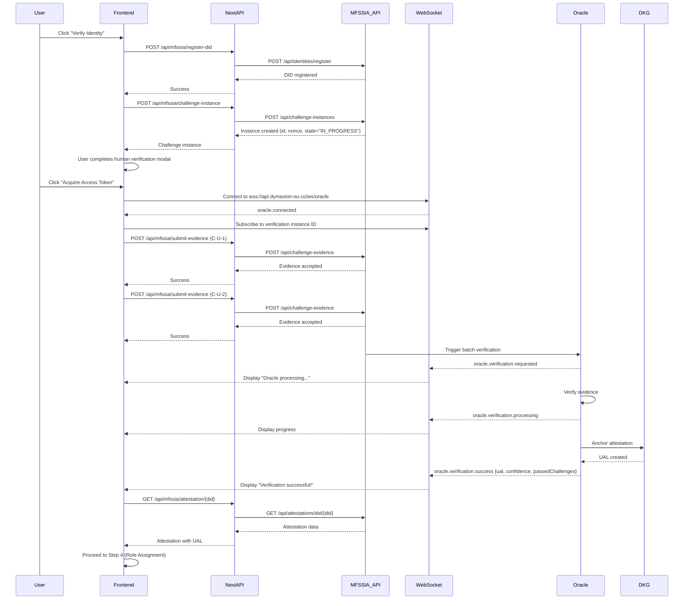

# MFSSIA WebSocket Integration - Implementation Plan

## Executive Summary

The MFSSIA team has released a new version of their API that supports real-time verification status updates via WebSocket (Socket.IO). This document provides a comprehensive plan to integrate this new functionality into the MKMPOL21 DAO onboarding process, fixing the current attestation retrieval issues.

## Current Problem Analysis

### Issue Description
The onboarding process fails at Step 3 (Token Acquisition) with the error:
```
[MFSSIA] POST /api/mfssia/submit-evidence - Error: "Internal server error"
```

### Root Cause Analysis

Based on code analysis (useOnboarding.ts:514-587), there are two main issues:

1. **Auto-Verified Instances Bug**: The `mfssia:Example-U` challenge set creates instances with `state="VERIFIED"` immediately, but the oracle service never creates attestations for them. This causes an infinite polling loop.

2. **Evidence Submission Error**: When instances are in `IN_PROGRESS` state, evidence submission fails with 500 errors, likely due to:
   - Incorrect payload structure
   - Missing challenge definition IDs
   - Timing/state mismatch issues

### Current Flow (Broken)
```
1. Register DID → Success ✓
2. Create Challenge Instance → Success ✓ (state="IN_PROGRESS" or "VERIFIED")
3. Submit Evidence → Fails ✗ (500 error)
   OR
   Poll for Attestation → Timeout ✗ (empty array forever)
```

## New MFSSIA WebSocket API

### Key Features

1. **Real-time Event Stream**: Subscribe to verification instance and receive live updates
2. **Oracle Gateway**: WebSocket endpoint at `wss://api.dymaxion-ou.co/ws/oracle`
3. **Event Types**:
   - `oracle.connected` - WebSocket connection established
   - `oracle.verification.requested` - Oracle started processing
   - `oracle.verification.processing` - Oracle is verifying evidence
   - `oracle.verification.success` - Verification passed, attestation created
   - `oracle.verification.failed` - Verification failed
   - `oracle.verification.error` - System error occurred

### Updated Process Flow



## Implementation Plan

### Phase 1: Dependencies & Services (30-45 min)

#### 1.1 Install Socket.IO Client
```bash
cd packages/nextjs
yarn add socket.io-client
```

**Files to create**: None
**Files to modify**: `packages/nextjs/package.json` (auto-updated)

#### 1.2 Create MFSSIA WebSocket Service

**File**: `packages/nextjs/services/MFSSIAWebSocketService.ts`

**Purpose**: Encapsulate WebSocket connection logic and event handling

**Key Features**:
- Singleton pattern for connection management
- Automatic reconnection with exponential backoff
- Type-safe event handling
- Connection state management
- Error handling and logging

**API**:
```typescript
class MFSSIAWebSocketService {
  // Connect to oracle gateway
  connect(): Promise<void>

  // Disconnect from gateway
  disconnect(): void

  // Subscribe to a verification instance
  subscribeToInstance(instanceId: string): void

  // Unsubscribe from instance
  unsubscribeFromInstance(instanceId: string): void

  // Register event listeners
  on(event: OracleEvent, callback: (data: any) => void): void
  off(event: OracleEvent, callback: (data: any) => void): void

  // Get connection state
  isConnected(): boolean
  getConnectionState(): ConnectionState
}

type OracleEvent =
  | 'oracle.connected'
  | 'oracle.verification.requested'
  | 'oracle.verification.processing'
  | 'oracle.verification.success'
  | 'oracle.verification.failed'
  | 'oracle.verification.error'

type ConnectionState =
  | 'disconnected'
  | 'connecting'
  | 'connected'
  | 'reconnecting'
  | 'error'
```

**Implementation Details**:
```typescript
import { io, Socket } from 'socket.io-client';

interface OracleSuccessPayload {
  verificationInstanceId: string;
  finalResult: boolean;
  passedChallenges: string[];
  confidence: number;
  ual?: string; // May or may not be included
  timestamp: string;
}

interface OracleFailedPayload {
  verificationInstanceId: string;
  finalResult: false;
  passedChallenges: string[];
  failedChallenges: string[];
  confidence: number;
  reason: string;
  timestamp: string;
}

interface OracleErrorPayload {
  verificationInstanceId: string;
  error: string;
  timestamp: string;
}

export class MFSSIAWebSocketService {
  private static instance: MFSSIAWebSocketService | null = null;
  private socket: Socket | null = null;
  private baseUrl: string;
  private connectionState: ConnectionState = 'disconnected';
  private eventHandlers: Map<string, Set<Function>> = new Map();
  private subscribedInstances: Set<string> = new Set();

  private constructor() {
    this.baseUrl = process.env.NEXT_PUBLIC_MFSSIA_API_URL || 'https://api.dymaxion-ou.co';
  }

  static getInstance(): MFSSIAWebSocketService {
    if (!this.instance) {
      this.instance = new MFSSIAWebSocketService();
    }
    return this.instance;
  }

  connect(): Promise<void> {
    return new Promise((resolve, reject) => {
      if (this.socket?.connected) {
        resolve();
        return;
      }

      this.connectionState = 'connecting';

      // Create WebSocket connection
      // IMPORTANT: Use base URL only (no path in URL). The /ws/oracle is the Engine.IO path, NOT a namespace.
      this.socket = io(this.baseUrl, {
        path: '/ws/oracle',  // Engine.IO endpoint (NOT a namespace)
        transports: ['websocket'],
        reconnection: true,
        reconnectionDelay: 1000,
        reconnectionDelayMax: 5000,
        reconnectionAttempts: 5,
      });

      // Connection handlers
      this.socket.on('connect', () => {
        console.log('[MFSSIA WS] Connected:', this.socket?.id);
        this.connectionState = 'connected';
        this.emit('oracle.connected', { socketId: this.socket?.id });
        resolve();
      });

      this.socket.on('disconnect', (reason) => {
        console.log('[MFSSIA WS] Disconnected:', reason);
        this.connectionState = 'disconnected';
      });

      this.socket.on('connect_error', (error) => {
        console.error('[MFSSIA WS] Connection error:', error);
        this.connectionState = 'error';
        reject(error);
      });

      this.socket.on('reconnect', (attemptNumber) => {
        console.log('[MFSSIA WS] Reconnected after', attemptNumber, 'attempts');
        this.connectionState = 'connected';

        // Re-subscribe to all instances
        this.subscribedInstances.forEach(instanceId => {
          this.socket?.emit('oracle.subscribe', { verificationInstanceId: instanceId });
        });
      });

      this.socket.on('reconnecting', (attemptNumber) => {
        console.log('[MFSSIA WS] Reconnecting attempt', attemptNumber);
        this.connectionState = 'reconnecting';
      });

      // Oracle event handlers
      this.socket.on('oracle.verification.requested', (data) => {
        console.log('[MFSSIA WS] Verification requested:', data);
        this.emit('oracle.verification.requested', data);
      });

      this.socket.on('oracle.verification.processing', (data) => {
        console.log('[MFSSIA WS] Verification processing:', data);
        this.emit('oracle.verification.processing', data);
      });

      this.socket.on('oracle.verification.success', (data: OracleSuccessPayload) => {
        console.log('[MFSSIA WS] Verification success:', data);
        this.emit('oracle.verification.success', data);
      });

      this.socket.on('oracle.verification.failed', (data: OracleFailedPayload) => {
        console.log('[MFSSIA WS] Verification failed:', data);
        this.emit('oracle.verification.failed', data);
      });

      this.socket.on('oracle.verification.error', (data: OracleErrorPayload) => {
        console.error('[MFSSIA WS] Verification error:', data);
        this.emit('oracle.verification.error', data);
      });
    });
  }

  disconnect(): void {
    this.subscribedInstances.clear();
    this.socket?.disconnect();
    this.socket = null;
    this.connectionState = 'disconnected';
  }

  subscribeToInstance(instanceId: string): void {
    if (!this.socket?.connected) {
      throw new Error('WebSocket not connected. Call connect() first.');
    }

    console.log('[MFSSIA WS] Subscribing to instance:', instanceId);
    this.subscribedInstances.add(instanceId);
    this.socket.emit('oracle.subscribe', { verificationInstanceId: instanceId });
  }

  unsubscribeFromInstance(instanceId: string): void {
    if (this.socket?.connected) {
      console.log('[MFSSIA WS] Unsubscribing from instance:', instanceId);
      this.socket.emit('oracle.unsubscribe', { verificationInstanceId: instanceId });
    }
    this.subscribedInstances.delete(instanceId);
  }

  on(event: OracleEvent, callback: (data: any) => void): void {
    if (!this.eventHandlers.has(event)) {
      this.eventHandlers.set(event, new Set());
    }
    this.eventHandlers.get(event)!.add(callback);
  }

  off(event: OracleEvent, callback: (data: any) => void): void {
    this.eventHandlers.get(event)?.delete(callback);
  }

  private emit(event: OracleEvent, data: any): void {
    this.eventHandlers.get(event)?.forEach(handler => {
      try {
        handler(data);
      } catch (error) {
        console.error(`[MFSSIA WS] Error in event handler for ${event}:`, error);
      }
    });
  }

  isConnected(): boolean {
    return this.socket?.connected ?? false;
  }

  getConnectionState(): ConnectionState {
    return this.connectionState;
  }
}

export const getMFSSIAWebSocket = () => MFSSIAWebSocketService.getInstance();

type ConnectionState = 'disconnected' | 'connecting' | 'connected' | 'reconnecting' | 'error';
type OracleEvent =
  | 'oracle.connected'
  | 'oracle.verification.requested'
  | 'oracle.verification.processing'
  | 'oracle.verification.success'
  | 'oracle.verification.failed'
  | 'oracle.verification.error';
```

### Phase 2: Update Existing Services (20-30 min)

#### 2.1 Update MFSSIAService.ts

**Changes**:
1. Remove `pollForAttestation()` method (replaced by WebSocket events)
2. Add method to get attestation once (non-polling)
3. Update error messages to guide users to check WebSocket connection

**Modified Methods**:
```typescript
/**
 * Get attestation for a DID (single attempt, no polling)
 * Use this after receiving oracle.verification.success event
 */
async getAttestation(did: string): Promise<AttestationResponse> {
  const endpoint = this.isBrowser
    ? `/api/mfssia/attestation/${encodeURIComponent(did)}`
    : `/api/attestations/did/${encodeURIComponent(did)}`;

  const response = await this.request<any>(endpoint);
  const data = this.unwrapResponse<AttestationResponse>(response);

  // Handle array response (API returns array of attestations)
  if (Array.isArray(data)) {
    if (data.length === 0) {
      throw new Error('No attestation found for this DID. Oracle may not have completed verification yet.');
    }
    return data[0]; // Return most recent attestation
  }

  return data;
}

/**
 * DEPRECATED: Use WebSocket events instead
 * This method is kept for backward compatibility but should not be used
 */
async pollForAttestation(did: string, maxAttempts = 30, intervalMs = 2000): Promise<AttestationResponse> {
  console.warn('[MFSSIA] pollForAttestation is deprecated. Use WebSocket events instead.');
  // ... existing implementation
}
```

#### 2.2 Fix submit-evidence API Route

**File**: `packages/nextjs/app/api/mfssia/submit-evidence/route.ts`

**Changes**:
1. Add detailed error logging
2. Validate challenge instance exists and is in correct state before submission
3. Map challenge codes to actual MFSSIA challenge IDs
4. Return detailed error messages

**Updated Implementation**:
```typescript
export async function POST(request: NextRequest) {
  if (!MFSSIA_ENABLED) {
    return NextResponse.json(
      { error: "MFSSIA service is not enabled" },
      { status: 503 }
    );
  }

  try {
    const body = await request.json();
    const { challengeInstanceId, challengeId, evidence } = body;

    if (!challengeInstanceId || !challengeId || !evidence) {
      return NextResponse.json(
        { error: "challengeInstanceId, challengeId, and evidence are required" },
        { status: 400 }
      );
    }

    console.log(`[MFSSIA API] Submitting evidence for challenge ${challengeId} on instance ${challengeInstanceId}`);
    console.log(`[MFSSIA API] Evidence payload:`, JSON.stringify(evidence, null, 2));

    // First, check the challenge instance state
    const instanceResponse = await fetch(`${MFSSIA_API_URL}/api/challenge-instances/${challengeInstanceId}`, {
      method: "GET",
      headers: {
        "Content-Type": "application/json",
      },
    });

    if (instanceResponse.ok) {
      const instanceData = await instanceResponse.json();
      const instance = instanceData.data || instanceData;

      console.log(`[MFSSIA API] Challenge instance state: ${instance.state}`);

      // Check if instance is in a state that accepts evidence
      if (instance.state === 'VERIFIED' || instance.state === 'COMPLETED' || instance.state === 'FAILED') {
        return NextResponse.json(
          {
            error: `Challenge instance is in state "${instance.state}" and cannot accept evidence. ` +
                   `This may be an auto-verified challenge set. Use WebSocket to listen for attestation creation.`,
            instanceState: instance.state,
            hint: instance.state === 'VERIFIED'
              ? 'This challenge set is auto-verified. Connect to WebSocket oracle to receive attestation.'
              : 'Instance has already been processed.'
          },
          { status: 409 } // Conflict
        );
      }
    }

    // Submit evidence to MFSSIA API
    const response = await fetch(`${MFSSIA_API_URL}/api/challenge-evidence`, {
      method: "POST",
      headers: {
        "Content-Type": "application/json",
      },
      body: JSON.stringify({
        challengeInstanceId,
        challengeId,
        evidence,
      }),
    });

    if (!response.ok) {
      const errorData = await response.json().catch(() => ({
        message: `HTTP ${response.status}: ${response.statusText}`,
      }));

      console.error('[MFSSIA API] Submit evidence failed:', {
        status: response.status,
        statusText: response.statusText,
        error: errorData,
        challengeInstanceId,
        challengeId,
      });

      return NextResponse.json(
        {
          error: errorData.message || errorData.error || "Failed to submit evidence",
          details: errorData,
          challengeId,
          instanceId: challengeInstanceId,
        },
        { status: response.status }
      );
    }

    const responseData = await response.json();
    console.log("[MFSSIA API] Submit evidence response:", JSON.stringify(responseData, null, 2));

    // MFSSIA API wraps responses in { success, message, data, statusCode, timestamp }
    // Extract the actual data from the "data" field
    const data = responseData.data || responseData;

    return NextResponse.json(data);
  } catch (error: any) {
    console.error("[MFSSIA API] Submit evidence error:", error);
    console.error("[MFSSIA API] Error stack:", error.stack);
    return NextResponse.json(
      {
        error: error.message || "Internal server error",
        stack: process.env.NODE_ENV === 'development' ? error.stack : undefined
      },
      { status: 500 }
    );
  }
}
```

### Phase 3: Update Onboarding Hook (45-60 min)

#### 3.1 Modify useOnboarding.ts

**File**: `packages/nextjs/hooks/useOnboarding.ts`

**Key Changes**:

1. **Add WebSocket state**:
```typescript
interface OnboardingState {
  // ... existing fields

  // Oracle WebSocket state
  oracleConnectionState: 'disconnected' | 'connecting' | 'connected' | 'error';
  oracleVerificationState: 'idle' | 'requested' | 'processing' | 'success' | 'failed' | 'error';
  oracleMessage: string | null;
  oracleConfidence: number | null;
}
```

2. **Initialize WebSocket in acquireAccessToken**:
```typescript
const acquireAccessToken = useCallback(async () => {
  // ... existing validation code

  setState(prev => ({
    ...prev,
    isAcquiringToken: true,
    tokenError: null,
    oracleConnectionState: 'connecting',
    oracleVerificationState: 'idle',
  }));

  try {
    const mfssia = getMFSSIAService();
    const ws = getMFSSIAWebSocket();

    // Connect to WebSocket
    logApiCall("info", "WebSocket", "Connecting to MFSSIA Oracle Gateway");
    await ws.connect();

    setState(prev => ({
      ...prev,
      oracleConnectionState: 'connected',
    }));

    logApiCall("success", "WebSocket", "Connected to Oracle Gateway");

    // Subscribe to this verification instance
    ws.subscribeToInstance(instanceId);
    logApiCall("info", "WebSocket", `Subscribed to instance ${instanceId}`);

    // Set up event listeners
    const handleSuccess = async (data: any) => {
      if (data.verificationInstanceId !== instanceId) return;

      logApiCall("success", "oracle.verification.success", "Oracle verification passed!", data);

      setState(prev => ({
        ...prev,
        oracleVerificationState: 'success',
        oracleMessage: 'Verification successful!',
        oracleConfidence: data.confidence,
      }));

      // Fetch attestation
      try {
        const attestation = await mfssia.getAttestation(did);

        if (!attestation || !attestation.ual) {
          throw new Error('Attestation not found after oracle success');
        }

        const isValid = mfssia.isAttestationValid(attestation);
        logApiCall("success", "GET /api/attestations", "Attestation retrieved", {
          ual: attestation.ual,
          valid: isValid,
          confidence: attestation.oracleProof?.confidence,
        });

        if (!isValid) {
          throw new Error('Retrieved attestation is invalid');
        }

        setState(prev => ({
          ...prev,
          isAcquiringToken: false,
          accessToken: attestation.ual,
          currentStep: "assign",
        }));

        // Cleanup
        ws.off('oracle.verification.success', handleSuccess);
        ws.off('oracle.verification.failed', handleFailed);
        ws.off('oracle.verification.error', handleError);
        ws.unsubscribeFromInstance(instanceId);
      } catch (error: any) {
        logApiCall("error", "GET /api/attestations", "Failed to retrieve attestation", error);
        throw error;
      }
    };

    const handleFailed = (data: any) => {
      if (data.verificationInstanceId !== instanceId) return;

      logApiCall("error", "oracle.verification.failed", "Oracle verification failed", data);

      setState(prev => ({
        ...prev,
        isAcquiringToken: false,
        oracleVerificationState: 'failed',
        oracleMessage: data.reason || 'Verification failed',
        tokenError: `Verification failed: ${data.reason}. Passed: ${data.passedChallenges?.join(', ') || 'none'}`,
      }));

      // Cleanup
      ws.off('oracle.verification.success', handleSuccess);
      ws.off('oracle.verification.failed', handleFailed);
      ws.off('oracle.verification.error', handleError);
      ws.unsubscribeFromInstance(instanceId);
    };

    const handleError = (data: any) => {
      if (data.verificationInstanceId !== instanceId) return;

      logApiCall("error", "oracle.verification.error", "Oracle error", data);

      setState(prev => ({
        ...prev,
        isAcquiringToken: false,
        oracleVerificationState: 'error',
        oracleMessage: data.error,
        tokenError: `Oracle error: ${data.error}`,
      }));

      // Cleanup
      ws.off('oracle.verification.success', handleSuccess);
      ws.off('oracle.verification.failed', handleFailed);
      ws.off('oracle.verification.error', handleError);
      ws.unsubscribeFromInstance(instanceId);
    };

    const handleRequested = (data: any) => {
      if (data.verificationInstanceId !== instanceId) return;
      logApiCall("info", "oracle.verification.requested", "Oracle started processing");
      setState(prev => ({
        ...prev,
        oracleVerificationState: 'requested',
        oracleMessage: 'Oracle verification requested',
      }));
    };

    const handleProcessing = (data: any) => {
      if (data.verificationInstanceId !== instanceId) return;
      logApiCall("info", "oracle.verification.processing", "Oracle is processing evidence");
      setState(prev => ({
        ...prev,
        oracleVerificationState: 'processing',
        oracleMessage: 'Oracle is verifying your evidence...',
      }));
    };

    // Register event handlers
    ws.on('oracle.verification.success', handleSuccess);
    ws.on('oracle.verification.failed', handleFailed);
    ws.on('oracle.verification.error', handleError);
    ws.on('oracle.verification.requested', handleRequested);
    ws.on('oracle.verification.processing', handleProcessing);

    // Now submit evidence
    logApiCall("info", "POST /api/challenge-evidence", "Submitting C-U-1: Wallet Ownership");

    const walletMessage = `MFSSIA Challenge\nNonce: ${nonce}\nAddress: ${address}\nTimestamp: ${new Date().toISOString()}`;
    const walletSignature = await signMessageAsync({ message: walletMessage });

    const cu1Evidence = {
      signature: walletSignature,
      nonce: nonce,
      address: address,
    };

    await mfssia.submitEvidence(instanceId, "mfssia:C-U-1", cu1Evidence);
    logApiCall("success", "POST /api/challenge-evidence", "C-U-1 evidence submitted");

    // Submit Challenge C-U-2
    logApiCall("info", "POST /api/challenge-evidence", "Submitting C-U-2: Human Verification");
    await mfssia.submitEvidence(instanceId, "mfssia:C-U-2", humanVerificationEvidence);
    logApiCall("success", "POST /api/challenge-evidence", "C-U-2 evidence submitted");

    logApiCall("info", "Oracle", "All evidence submitted. Waiting for oracle verification...");

    // Oracle will now process and emit events through WebSocket
    // The handleSuccess callback will handle the rest

  } catch (error: any) {
    logApiCall("error", "acquireAccessToken", "Token acquisition failed", error);

    // Cleanup WebSocket on error
    try {
      const ws = getMFSSIAWebSocket();
      if (ws.isConnected()) {
        ws.unsubscribeFromInstance(instanceId);
      }
    } catch (cleanupError) {
      console.warn('[ONBOARDING] WebSocket cleanup error:', cleanupError);
    }

    setState(prev => ({
      ...prev,
      isAcquiringToken: false,
      tokenError: error.message || "Failed to acquire access token",
      oracleConnectionState: 'error',
    }));
  }
}, [/* dependencies */]);
```

3. **Add cleanup on unmount**:
```typescript
useEffect(() => {
  return () => {
    // Cleanup WebSocket on unmount
    try {
      const ws = getMFSSIAWebSocket();
      if (state.instanceId && ws.isConnected()) {
        ws.unsubscribeFromInstance(state.instanceId);
      }
    } catch (error) {
      console.warn('[ONBOARDING] Cleanup error:', error);
    }
  };
}, [state.instanceId]);
```

### Phase 4: Update UI Components (30-40 min)

#### 4.1 Update OnboardingFlow.tsx

**File**: `packages/nextjs/components/dao/OnboardingFlow.tsx`

**Changes**:

1. **Add oracle status display in Step 3**:
```typescript
{/* Step 3: Access Token */}
{currentStep === "token" && (
  <div className="card bg-base-100 shadow-xl border border-base-300 animate-fade-in">
    <div className="card-body">
      {/* ... existing header ... */}

      {/* Oracle Status Display */}
      {isAcquiringToken && (
        <div className="bg-base-200 rounded-xl p-4 mb-6">
          <div className="flex items-center gap-3 mb-3">
            <div className="w-3 h-3 bg-blue-500 rounded-full animate-pulse"></div>
            <span className="font-semibold">Oracle Status</span>
          </div>

          {/* WebSocket Connection */}
          <div className="flex items-center justify-between mb-2">
            <span className="text-sm text-base-content/70">WebSocket Connection</span>
            <span className={`badge badge-sm ${
              oracleConnectionState === 'connected' ? 'badge-success' :
              oracleConnectionState === 'connecting' ? 'badge-warning' :
              oracleConnectionState === 'error' ? 'badge-error' :
              'badge-ghost'
            }`}>
              {oracleConnectionState}
            </span>
          </div>

          {/* Verification State */}
          <div className="flex items-center justify-between mb-2">
            <span className="text-sm text-base-content/70">Verification Status</span>
            <span className={`badge badge-sm ${
              oracleVerificationState === 'success' ? 'badge-success' :
              oracleVerificationState === 'processing' ? 'badge-info' :
              oracleVerificationState === 'requested' ? 'badge-warning' :
              oracleVerificationState === 'failed' || oracleVerificationState === 'error' ? 'badge-error' :
              'badge-ghost'
            }`}>
              {oracleVerificationState}
            </span>
          </div>

          {/* Oracle Message */}
          {oracleMessage && (
            <div className="text-sm text-base-content/70 mt-3 p-2 bg-base-100 rounded">
              {oracleMessage}
            </div>
          )}

          {/* Confidence Score */}
          {oracleConfidence !== null && (
            <div className="mt-3">
              <div className="flex items-center justify-between mb-1">
                <span className="text-xs text-base-content/70">Confidence Score</span>
                <span className="text-xs font-mono">{(oracleConfidence * 100).toFixed(1)}%</span>
              </div>
              <progress
                className="progress progress-success w-full"
                value={oracleConfidence * 100}
                max="100"
              ></progress>
            </div>
          )}

          {/* Progress Steps */}
          <div className="mt-4 space-y-2">
            <div className={`flex items-center gap-2 text-sm ${
              oracleConnectionState === 'connected' ? 'text-success' : 'text-base-content/50'
            }`}>
              {oracleConnectionState === 'connected' ? (
                <CheckCircleIcon className="w-4 h-4" />
              ) : (
                <SpinnerIcon className="w-4 h-4" />
              )}
              <span>Connected to Oracle Gateway</span>
            </div>

            <div className={`flex items-center gap-2 text-sm ${
              ['requested', 'processing', 'success'].includes(oracleVerificationState) ? 'text-success' : 'text-base-content/50'
            }`}>
              {['requested', 'processing', 'success'].includes(oracleVerificationState) ? (
                oracleVerificationState === 'success' ? (
                  <CheckCircleIcon className="w-4 h-4" />
                ) : (
                  <SpinnerIcon className="w-4 h-4" />
                )
              ) : (
                <div className="w-4 h-4 border-2 border-base-content/20 rounded-full"></div>
              )}
              <span>Evidence Submitted</span>
            </div>

            <div className={`flex items-center gap-2 text-sm ${
              ['processing', 'success'].includes(oracleVerificationState) ? 'text-success' : 'text-base-content/50'
            }`}>
              {['processing', 'success'].includes(oracleVerificationState) ? (
                oracleVerificationState === 'success' ? (
                  <CheckCircleIcon className="w-4 h-4" />
                ) : (
                  <SpinnerIcon className="w-4 h-4" />
                )
              ) : (
                <div className="w-4 h-4 border-2 border-base-content/20 rounded-full"></div>
              )}
              <span>Oracle Verification</span>
            </div>

            <div className={`flex items-center gap-2 text-sm ${
              oracleVerificationState === 'success' ? 'text-success' : 'text-base-content/50'
            }`}>
              {oracleVerificationState === 'success' ? (
                <CheckCircleIcon className="w-4 h-4" />
              ) : (
                <div className="w-4 h-4 border-2 border-base-content/20 rounded-full"></div>
              )}
              <span>Attestation Created</span>
            </div>
          </div>
        </div>
      )}

      {/* ... existing error and button elements ... */}
    </div>
  </div>
)}
```

2. **Update destructured props to include oracle state**:
```typescript
const {
  // ... existing props
  oracleConnectionState,
  oracleVerificationState,
  oracleMessage,
  oracleConfidence,
} = onboarding;
```

### Phase 5: Environment Configuration (5 min)

#### 5.1 Update .env.local

**File**: `packages/nextjs/.env.local`

**Add**:
```bash
# MFSSIA Configuration
NEXT_PUBLIC_MFSSIA_ENABLED=true
NEXT_PUBLIC_MFSSIA_API_URL=https://api.dymaxion-ou.co
MFSSIA_API_URL=https://api.dymaxion-ou.co
```

### Phase 6: Testing & Validation (60-90 min)

#### 6.1 Unit Tests

Create test file: `packages/nextjs/services/__tests__/MFSSIAWebSocketService.test.ts`

**Test Cases**:
1. Singleton instance creation
2. Connection establishment
3. Event subscription and emission
4. Reconnection logic
5. Error handling
6. Cleanup on disconnect

#### 6.2 Integration Test Checklist

**Manual Testing Flow**:
1. ✓ Start local chain: `yarn chain`
2. ✓ Deploy contracts: `yarn deploy`
3. ✓ Start frontend: `yarn start`
4. ✓ Navigate to onboarding page
5. ✓ Connect wallet (use Hardhat test account)
6. ✓ Click "Verify Identity"
   - Check: DID registration successful
   - Check: Challenge instance created
   - Check: Human verification modal appears
7. ✓ Complete human verification
   - Check: Modal closes
   - Check: Step advances to "Token"
8. ✓ Click "Acquire Access Token"
   - Check: WebSocket connects (green status)
   - Check: Evidence submission successful (C-U-1)
   - Check: Evidence submission successful (C-U-2)
   - Check: Oracle status changes to "requested"
   - Check: Oracle status changes to "processing"
   - Check: Oracle status changes to "success"
   - Check: Confidence score displays
   - Check: Attestation retrieved
   - Check: Step advances to "Assign"
9. ✓ Click "Assign Role"
   - Check: Transaction succeeds
   - Check: Step advances to "Complete"
   - Check: User can navigate to dashboard

#### 6.3 Error Scenarios to Test

1. **WebSocket connection failure**:
   - Simulate: Block wss://api.dymaxion-ou.co
   - Expected: Error message, fallback option

2. **Oracle verification failure**:
   - Simulate: Submit invalid evidence
   - Expected: oracle.verification.failed event, clear error message

3. **Network disconnection**:
   - Simulate: Disconnect internet mid-verification
   - Expected: Reconnection attempt, re-subscription to instance

4. **Timeout scenarios**:
   - Simulate: Oracle takes >60 seconds
   - Expected: Timeout warning, option to retry

## API Endpoint Reference

### REST API Endpoints Used

| Endpoint | Method | Purpose | Request Body | Response |
|----------|--------|---------|--------------|----------|
| `/api/identities/register` | POST | Register DID | `{did, requestedChallengeSet, metadata}` | Identity object |
| `/api/challenge-instances` | POST | Create instance | `{did, challengeSet}` | Instance object with ID, nonce |
| `/api/challenge-instances/{id}` | GET | Get instance state | N/A | Instance with state |
| `/api/challenge-evidence` | POST | Submit evidence | `{challengeInstanceId, challengeId, evidence}` | Evidence receipt |
| `/api/attestations/did/{did}` | GET | Get attestation | N/A | Attestation array |

### WebSocket Events

| Event | Direction | Payload | Description |
|-------|-----------|---------|-------------|
| `oracle.subscribe` | Client → Server | `{verificationInstanceId}` | Subscribe to instance |
| `oracle.unsubscribe` | Client → Server | `{verificationInstanceId}` | Unsubscribe from instance |
| `oracle.connected` | Server → Client | `{socketId}` | Connection established |
| `oracle.verification.requested` | Server → Client | `{verificationInstanceId, timestamp}` | Oracle started |
| `oracle.verification.processing` | Server → Client | `{verificationInstanceId, timestamp}` | Oracle processing |
| `oracle.verification.success` | Server → Client | `{verificationInstanceId, finalResult, passedChallenges, confidence, ual?, timestamp}` | Verification passed |
| `oracle.verification.failed` | Server → Client | `{verificationInstanceId, finalResult, passedChallenges, failedChallenges, confidence, reason, timestamp}` | Verification failed |
| `oracle.verification.error` | Server → Client | `{verificationInstanceId, error, timestamp}` | System error |

## Challenge Evidence Payloads

### C-U-1: Wallet Ownership Proof

```json
{
  "signature": "0x...",
  "nonce": "0x...",
  "address": "0x..."
}
```

### C-U-2: Human Interaction Verification

```json
{
  "interactionTimestamp": "2026-01-08T14:30:00.000Z",
  "timeToInteract": 2345,
  "userAgent": "Mozilla/5.0..."
}
```

## Timeline Estimate

| Phase | Task | Time Estimate |
|-------|------|---------------|
| 1 | Install dependencies & create WebSocket service | 30-45 min |
| 2 | Update existing services | 20-30 min |
| 3 | Modify onboarding hook | 45-60 min |
| 4 | Update UI components | 30-40 min |
| 5 | Environment configuration | 5 min |
| 6 | Testing & validation | 60-90 min |
| **Total** | | **3-4.5 hours** |

## Risk Mitigation

### Potential Issues

1. **WebSocket Connection Failures**
   - Mitigation: Automatic reconnection with exponential backoff
   - Fallback: Option to retry entire flow

2. **Oracle Timeout**
   - Mitigation: 60-second timeout with clear messaging
   - Fallback: Allow user to restart verification

3. **State Synchronization**
   - Mitigation: Use refs and localStorage for persistence
   - Fallback: Clear error messages directing user to restart

4. **Browser Compatibility**
   - Mitigation: Socket.IO handles WebSocket/polling fallbacks automatically
   - Fallback: Display browser compatibility warning

## Success Criteria

✓ User can complete full onboarding flow without errors
✓ Real-time oracle status displayed correctly
✓ Attestation retrieved successfully after oracle verification
✓ Role assigned on blockchain
✓ User can access dashboard with assigned role
✓ All API calls logged for debugging
✓ Error messages are clear and actionable
✓ WebSocket reconnects automatically on disconnection
✓ No polling loops or timeouts

## Post-Implementation

### Monitoring

1. Add logging for WebSocket connection metrics
2. Track oracle verification success/failure rates
3. Monitor average verification time
4. Alert on repeated connection failures

### Documentation Updates

1. Update README with new WebSocket requirements
2. Add troubleshooting guide for common WebSocket issues
3. Document oracle event handling for developers
4. Create user guide for onboarding process

### Future Enhancements

1. Add retry logic for failed verifications
2. Implement progress bar based on oracle events
3. Add notification system for verification completion
4. Support multiple challenge sets with different evidence requirements
5. Add admin dashboard to monitor onboarding success rates

---

## Appendix A: MFSSIA Challenge Sets

### mfssia:Example-U (DAO User Onboarding)

**Challenges:**
- C-U-1: Wallet Ownership Proof
- C-U-2: Human Interaction Verification

**Policy**: Both challenges must pass (confidence = 1.0)

**Auto-Verification**: This challenge set may be auto-verified by MFSSIA API depending on configuration

### Challenge Definition IDs

The MFSSIA API uses UUIDs for challenge definitions. Here's the mapping:

| Challenge Code | Challenge Name | UUID (if known) |
|---------------|----------------|-----------------|
| mfssia:C-U-1 | Wallet Ownership Proof | TBD - check API docs |
| mfssia:C-U-2 | Human Interaction Verification | TBD - check API docs |

**Note**: If evidence submission fails, verify that challenge codes match the actual UUIDs expected by the API.

## Appendix B: Troubleshooting Guide

### Error: "Challenge instance is not in progress"

**Cause**: Instance is already verified or completed
**Solution**: This is an auto-verified challenge set. Use WebSocket flow instead of evidence submission.

### Error: "WebSocket connection failed"

**Cause**: Network firewall blocking WSS connections
**Solution**:
1. Check browser console for CORS errors
2. Verify `wss://api.dymaxion-ou.co/ws/oracle` is accessible
3. Try from different network

### Error: "Attestation not found"

**Cause**: Oracle hasn't created attestation yet
**Solution**:
1. Wait for `oracle.verification.success` event
2. Check that all evidence was submitted correctly
3. Verify instance ID matches

### Warning: "Oracle taking longer than expected"

**Cause**: Heavy oracle load or complex verification
**Solution**:
1. Display patience message to user
2. Continue listening for events (don't timeout prematurely)
3. If >2 minutes, offer retry option

---

**Last Updated**: 2026-01-08
**Version**: 1.0
**Author**: Claude Code
